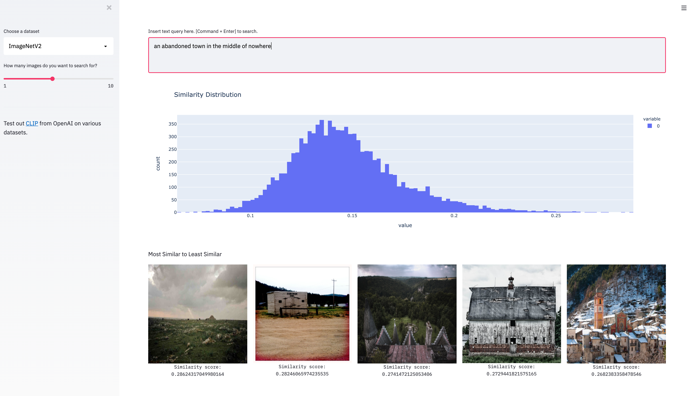
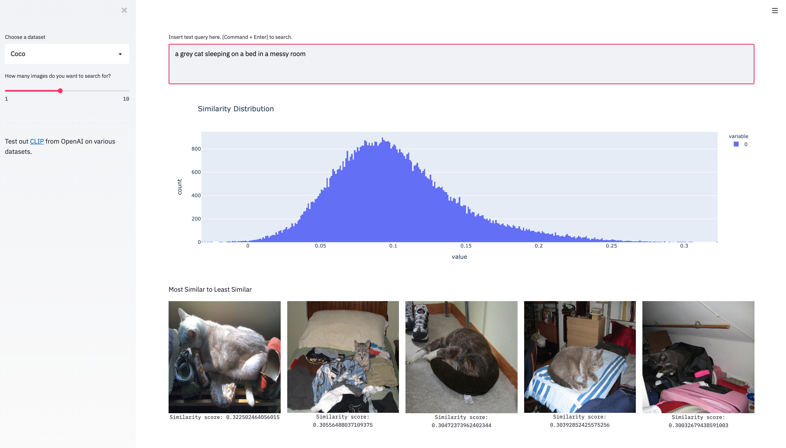

# qclip

Test out [CLIP](https://openai.com/blog/clip) from OpenAI on various datasets like [ImageNetV2](https://imagenetv2.org/), [Coco](https://cocodataset.org/), and [DeepDrive](https://bdd-data.berkeley.edu/). 

## Examples





## Usage

Install the dependencies from `requirements.txt`

```
pip install -r requirements.txt 
```

Follow the instructions below depending on which datasets you want to query:
* For [ImageNetv2](https://imagenetv2.org/), download the matched-frequency dataset to the `imagenetv2` directory. 
* For [Coco](https://cocodataset.org/), download the [features](https://cmu.app.box.com/s/t6fbkyfb7j28yhts9zg8ugbwo57aotos) to the `coco` directory.
* For [DeepDrive](https://bdd-data.berkeley.edu/), download the Images dataset and the [features](https://cmu.box.com/s/m39dgck0ie1ebuq7hozpy64m67t15udb) to the `bdd` directory. 

Run the Streamlit app

```
streamlit run clip_app.py
```

## Adding New Datasets

The Jupyter notebooks in `notebooks` show how new datasets can be processed. 
